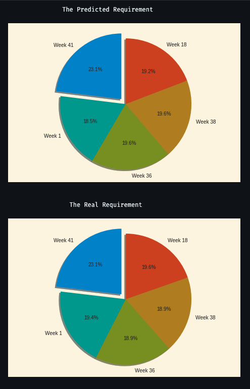

# Inventory Prediction and Smart Inventory Management System

## Visualization Example

Below is a comparison of the **Predicted Requirement** and **Real Requirement** visualized using pie charts:

## Overview
This project focuses on inventory prediction, aiming to forecast the demand for specific items in the future and track inventory levels based on predicted results. By leveraging machine learning techniques and time series analysis, the system minimizes complications such as overstocking, understocking, and dead-stock, while reducing maintenance costs.

The project is implemented in the `main.ipynb` file, which contains the complete workflow from data generation to forecasting and visualization. Additionally, the notebook includes commented-out code for sending sample emails with the forecast results.

## Features
- **Sample Sales Data Generation**: Creates synthetic sales data for various items to simulate real-world scenarios.
- **Machine Learning-Based Forecasting**: Implements a multi-step dynamic forecasting model that combines machine learning techniques with time series analysis.
- **Graphical Visualization**: Generates graphs to showcase forecasted trends, including long-term, short-term, and periodic trends.
- **Email Notification (Optional)**: Includes commented-out code to send forecast results via email for enhanced usability.

## Motivation
Traditional inventory prediction methods often rely on simplistic approaches, such as calculating past averages, which fail to capture complex patterns like:
- Long-term trends
- Short-term trends
- Periodic trends
- Special events (e.g., festive trends)

This project addresses these limitations by treating inventory management as a data mining problem and incorporating multiple factors into a dynamic prediction model.

## Methodology
1. **Data Generation**: Synthetic sales data is generated to simulate inventory scenarios.
2. **Dynamic Forecasting Model**:
   - Combines machine learning techniques with time series analysis.
   - Considers multiple factors, such as historical data, trends, and special events.
3. **Visualization**: Forecast results are visualized through graphs for better interpretability.
4. **Optional Email Notifications**: Forecast results can be sent via email for proactive inventory management.

## Results
The proposed system demonstrates the potential and efficiency of dynamic inventory prediction through probationary results and practical implementation. It provides a robust solution for smart inventory management by addressing the challenges of traditional methods.

## How to Use
1. Open the `main.ipynb` file in Jupyter Notebook or any compatible environment.
2. Run the notebook step-by-step to:
   - Generate sample sales data.
   - Execute the machine learning logic for forecasting.
   - Visualize the forecasted trends through graphs.
3. (Optional) Uncomment the email notification code to send forecast results via email.

## Requirements
- Python 3.x
- Jupyter Notebook
- Required libraries (install via `pip`):
  - `numpy`
  - `pandas`
  - `matplotlib`
  - `scikit-learn`
  - `statsmodels`
  - `smtplib` (for email functionality)

## Future Work
- Integration with real-world inventory datasets.
- Deployment as a web-based or mobile application.
- Incorporation of advanced deep learning models for improved accuracy.

## Conclusion
This project provides a comprehensive solution for inventory prediction and management by combining machine learning, time series analysis, and visualization. It offers a dynamic and efficient approach to address the challenges of traditional inventory prediction methods.